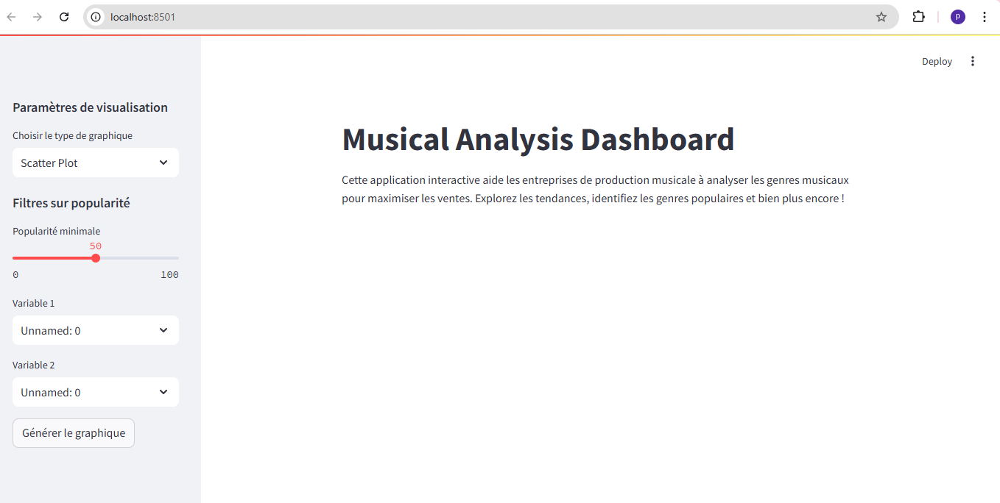
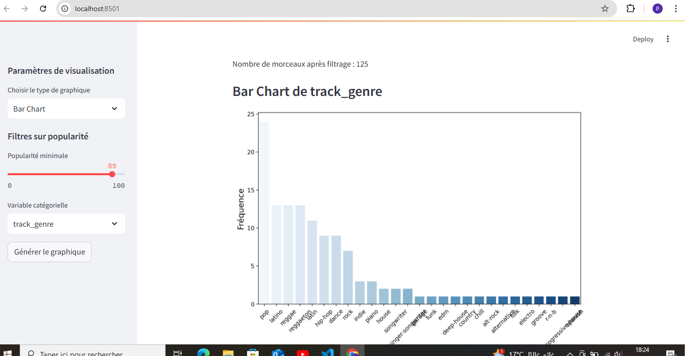
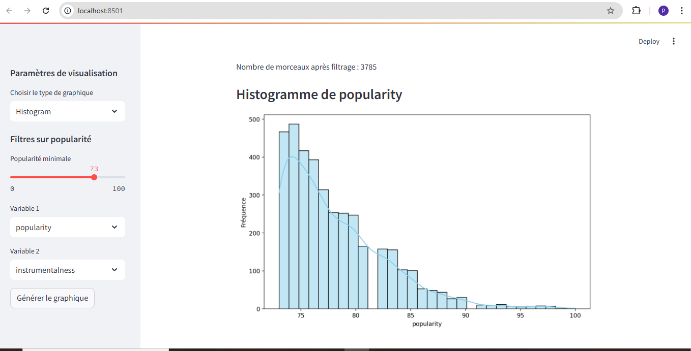
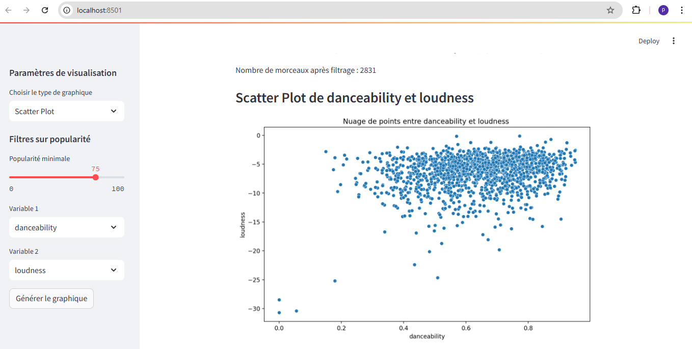
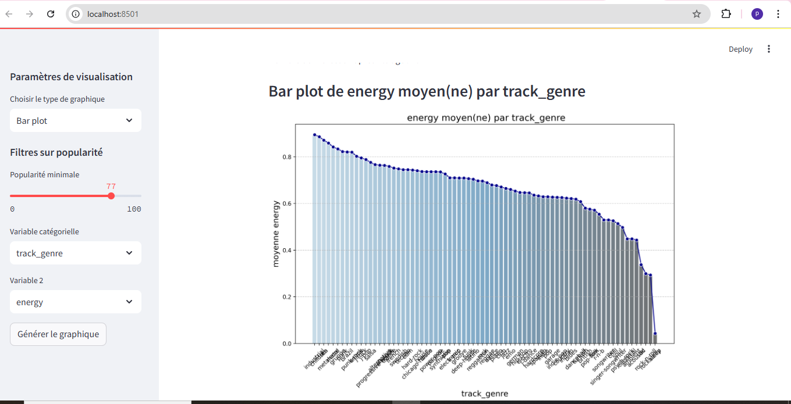
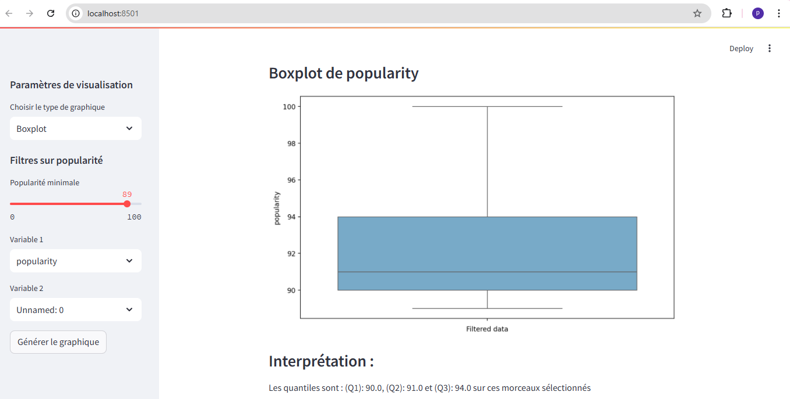
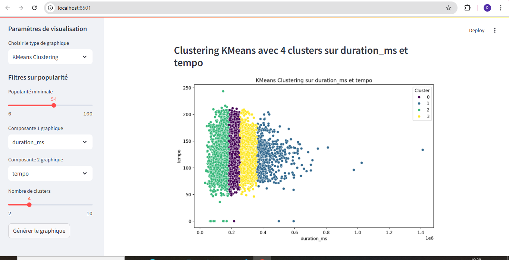
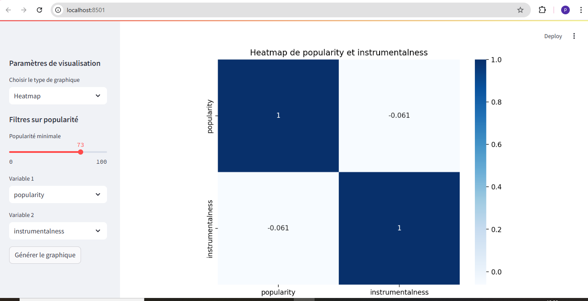

# Musical Analysis Dashboard

## Description

Le **Musical Analysis Dashboard** est une application interactive développée pour aider les entreprises de production musicale à déterminer quel genre musical maximiserait le nombre de ventes. L'application permet d'explorer des données sur les morceaux de musique à l'aide de visualisations claires et interactives, en se concentrant sur des métriques telles que la popularité, l'énergie, le tempo, et la dansabilité par genre musical.

Les utilisateurs peuvent explorer différents aspects des morceaux de musique, analyser les tendances de ventes, et découvrir quel genre de musique est le plus susceptible d'augmenter les ventes. Ce tableau de bord est construit avec **Streamlit** pour une interface simple et interactive, et utilise des visualisations dynamiques grâce à des bibliothèques telles que **Matplotlib**, **Seaborn**, et **Plotly**.

### Fonctionnalités

- **Page d'accueil interactive** : Une introduction claire à l'application avec un bouton pour accéder au dashboard.


- **Dashboard interactif** : Visualisations des genres musicaux, de leur popularité et des caractéristiques musicales (énergie, tempo, etc.).



- **Comparaison des genres** : Comparaison des chiffres moyens par genre avec des graphiques combinés.

- **Analyse avancée des données musicales** : Exploration des caractéristiques comme la dansabilité, l'énergie, et plus encore.



- **Interprétation des résultats** : Chaque graphique est accompagné d'une interprétation pour aider à tirer des conclusions.

## Installation

### Prérequis

1. **Python 3.7+** - L'application utilise Python 3.7 ou supérieur.
2. **Poetry** - Un gestionnaire de dépendances pour Python, qui crée et gère un environnement virtuel pour le projet.

### Étapes d'installation

1. **Cloner le dépôt**

   Clonez ce dépôt sur votre machine locale :

   ```bash
   git clone https://github.com/Rodmigniha/musical-analysis-dashboard.git
   cd musical-analysis-dashboard
   ```

2. **Installer Poetry**

   Si Poetry n'est pas installé, vous pouvez l'installer en exécutant :

   ```bash
   pip install poetry
   ```

3. **Installer les dépendances**

   Utilisez Poetry pour installer toutes les dépendances nécessaires au projet :

   ```bash
   poetry install
   ```

4. **Démarrer l'application**

   Après l'installation des dépendances, lancez l'application avec Streamlit :

   ```bash
   streamlit run app/main.py
   ```

   Cela ouvrira l'application dans votre navigateur.

## Structure du projet

Voici la structure du projet :

```
musical-analysis-dashboard/
├── app/
│   ├── __init__.py
│   ├
│   ├── visualizations.py
│   ├── main.py
├── data/
│   
├── .gitignore
├── README.md
├── requirements.txt
```

### Fichiers principaux

- **app/main.py** : Le fichier principal qui contient l'application Streamlit.
- **app/visualizations.py** : Gère la création des visualisations interactives.
- **data/README.md** : Contient des informations sur les données utilisées dans le projet.


## Technologies utilisées

- **Streamlit** : Pour l'interface web interactive.
- **Pandas** : Pour le traitement des données.
- **Matplotlib** / **Seaborn** / **Plotly** : Pour les visualisations.
- **streamlit** : Pour l'hébergement et le déploiement de l'application.

## Contribuer

Les contributions à ce projet sont les bienvenues ! Si vous avez des suggestions ou des améliorations, n'hésitez pas à ouvrir une **pull request**.

1. Fork ce dépôt.
2. Créez une branche pour votre fonctionnalité (`git checkout -b feature/your-feature`).
3. Commitez vos modifications (`git commit -am 'Add your feature'`).
4. Poussez la branche (`git push origin feature/your-feature`).
5. Ouvrez une **pull request**.

🌐 Contact

Pour toute question ou demande de partenariat, n’hésitez pas à me contacter :

Email : anzantchede-parfait.migniha@dauphine.eu , kidam.migniha@gmail.com , rodrigue.pro2020@gmail.com GitHub : https://github.com/Rodmigniha/EasyLearning-chatbot.git